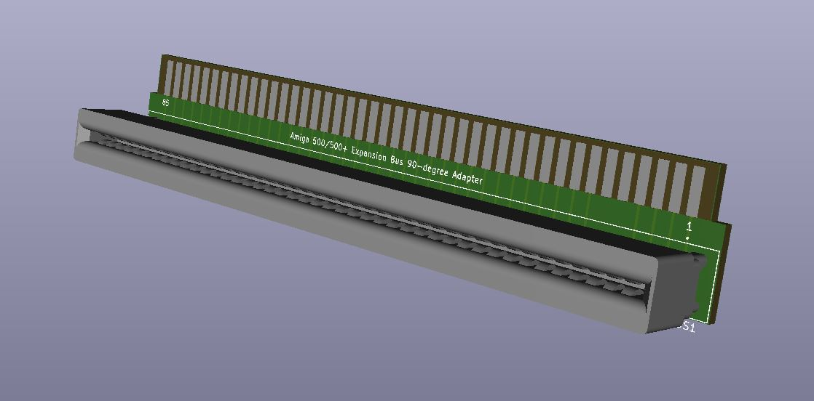

# Amiga 500 Side Expansion 90-degree
A simple 90-degree side expansion slot adapter that I'm using in my Amiga 500 tower build.

## Assembly
* Order the PCB from your PCB fab of choice. (JLCPCB, PCBway, OSH Park, etc.)
* Solder a 86-pin 2.54mm card edge connector to it. (ex: TE Connectivity 1-5530843-0)
* Install on the side expansion slot of your A500.

## Note
I made this for my Amiga 500 tower, and I don't believe it will fit properly inside the original A500 housing.

## Other
This is open source hardware, do what you want with it.
